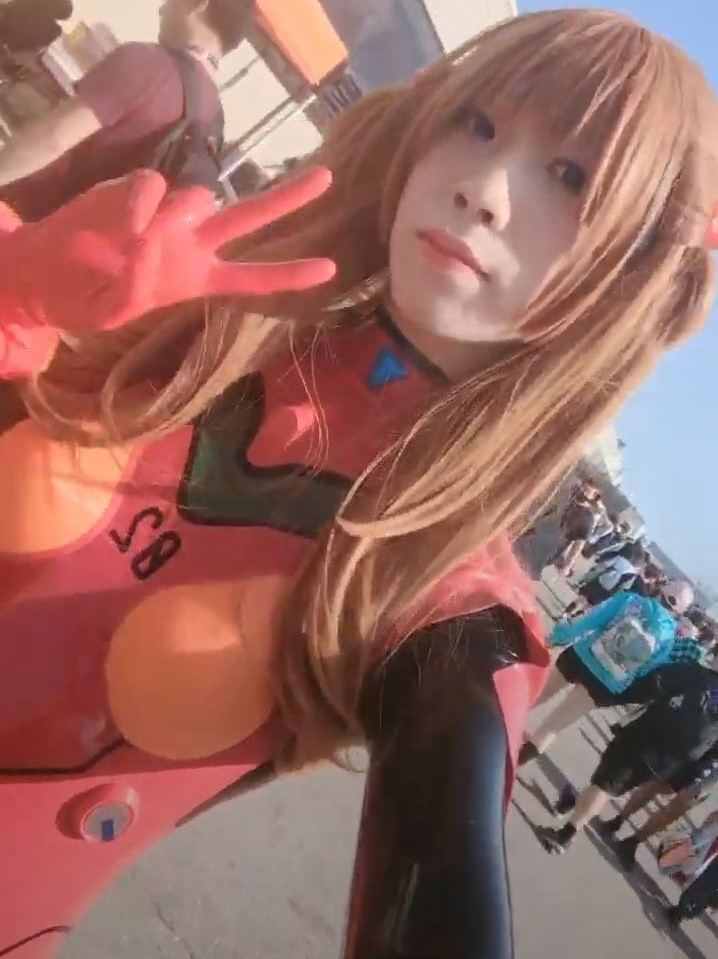

# Asuka Plugsui (from Neon Genesis Evangelion)

This costume was design and made for [Anime North](https://www.animenorth.com/) 2023

3D printed and laser cutted parts were used in making of this costume.

Calling this quite some efforts will be a gross understatement...

## Photos

| | | |
|:-------------------------:|:-------------------------:|:-------------------------:|
  |   | 

## Construction

| | | |
|:-------------------------:|:-------------------------:|:-------------------------:|
  |   |  
  |   | 
